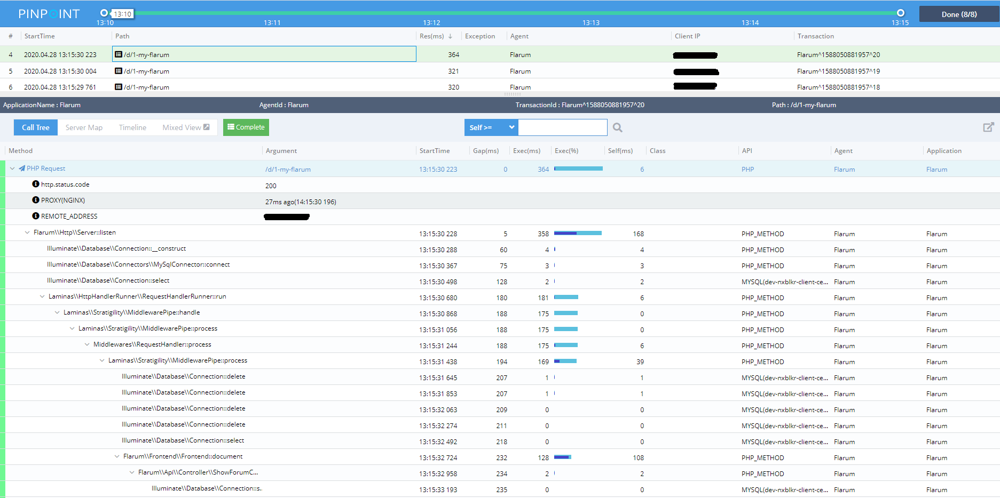


> Contents

[toc]

### How does pinpoint-php agent work?

Pinpoint php agent employs [php_simple_aop](https://github.com/eeliu/php_simple_aop) as its aspect programming library, it helps converting origin class.php to proxied_class.php which includes plugins.php and origin.php without affecting any function of origin class.php.

``` php
+--------------+                    +-----------------------+
|  origin.php  |                    | origin.php            |
|              |                    | proxied_origin.php    |
+--------------+                    | require_origin.php    |
                                    | entry for plugins.php |
      ^                             +-----------------------+
      |
      |   Before                                   ^
      |                                            |   After
      |                                            |
      +----+    vender/class_loader        +-------+

```

## Performance Result


* Call Tree



> Summary
* Less than 5% loss, when Flarum add PHP Agent.

If you care about the performance most, you can call pinpoint-php agent module API directly, which is written by C&C++. 

## How to hook a object ?

```
use A\a as a;
class Foo{
      public function foo(): a
      {
            return new a::factory_create_new();
      }
}

```

> As foo returns a new object and this scenario can't be detected by php_simple_aop easily.

### Use a decorator

Replace the return object with a decorated object in onEnd(). There are some [magic methods](https://www.php.net/manual/en/language.oop5.magic.php) to help "hacking" the object.

[Click me ☚](../../PHP/pinpoint_php_example/Plugins/InstancePlugins.php)


### Examples

####  Hook a generator.

> https://github.com/naver/pinpoint-c-agent/issues/100


#### PDO::prepare return a PDOStatement

``` php
Reference： https://www.php.net/manual/zh/pdo.prepare.php
<?php

$sth = $dbh->prepare('SELECT name, colour, calories
    FROM fruit
    WHERE calories < ? AND colour = ?');
$sth->execute(array(150, 'red'));
$red = $sth->fetchAll();
$sth->execute(array(175, 'yellow'));
$yellow = $sth->fetchAll();
?>

```

Replace $dbh->prepare return value with [Plugins\PDOStatement](../../PHP/pinpoint_php_example/Plugins/PDOStatement.php).


#### Generator
