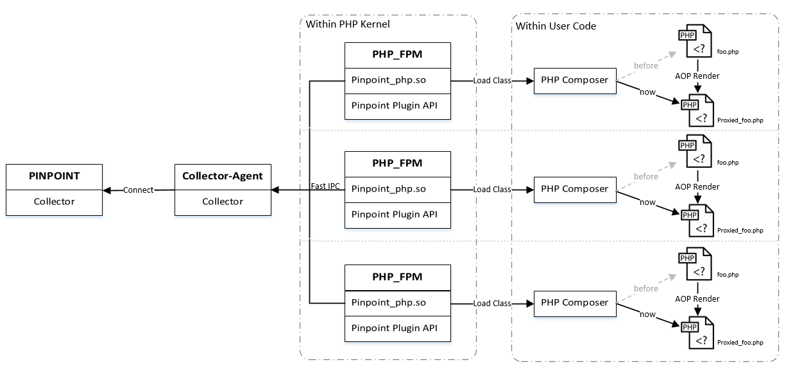
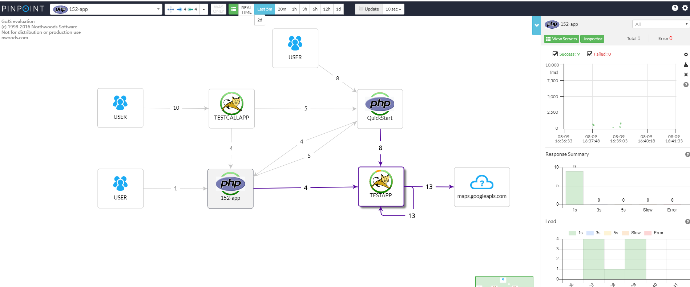
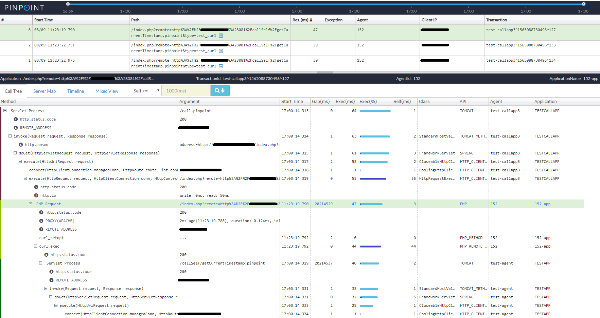
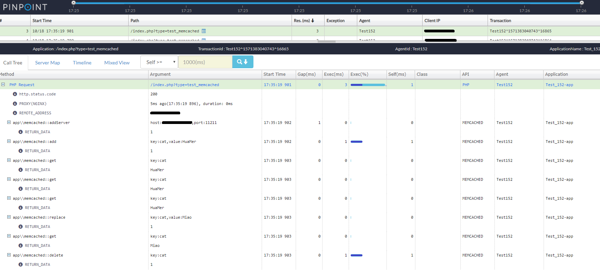
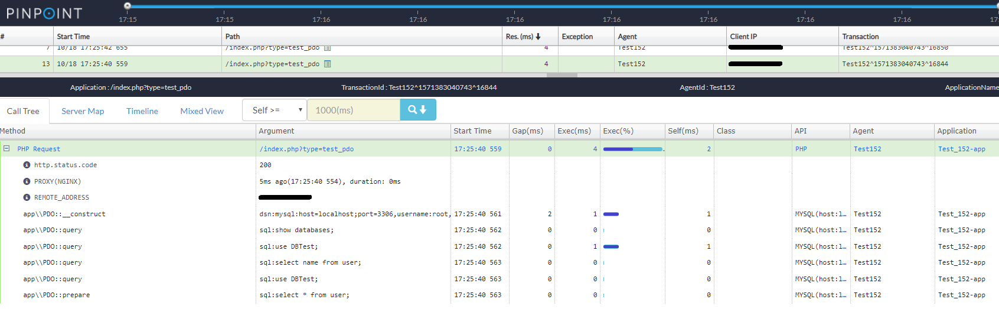
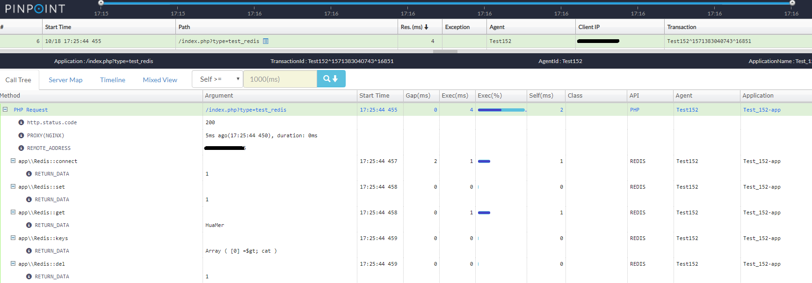

[](https://travis-ci.com/naver/pinpoint-c-agent) [](https://gitter.im/naver/pinpoint-c-agent?utm_source=badge&utm_medium=badge&utm_campaign=pr-badge)

**Visit [our official web site](http://naver.github.io/pinpoint/) for more information and [Latest updates on Pinpoint](https://naver.github.io/pinpoint/news.html)**  


The current stable version is [Lastest](https://github.com/naver/pinpoint-c-agent/releases).

# Pinpoint Common Agent

It is an agent written by C++, PHP, python language. And we hope to support other languages by this agent. Until now, it supports **_PHP_** and **_PYTHON_**.

## PHP 

[Click me ☚](PHP/Readme.md)

## PYTHON

[Click me ☚](PY/Readme.md)


## Overview PHP Agent

### Pinpoint-c-agent 


### Distributed Tracking system

### Call Stack

 | 
--- | ---
 | 


## Overview PYTHON Agent

## License
This project is licensed under the Apache License, Version 2.0.
See [LICENSE](LICENSE) for full license text.

```
Copyright 2020 NAVER Corp.

Licensed under the Apache License, Version 2.0 (the "License");
you may not use this file except in compliance with the License.
You may obtain a copy of the License at

    http://www.apache.org/licenses/LICENSE-2.0

Unless required by applicable law or agreed to in writing, software
distributed under the License is distributed on an "AS IS" BASIS,
WITHOUT WARRANTIES OR CONDITIONS OF ANY KIND, either express or implied.
See the License for the specific language governing permissions and
limitations under the License.
```
