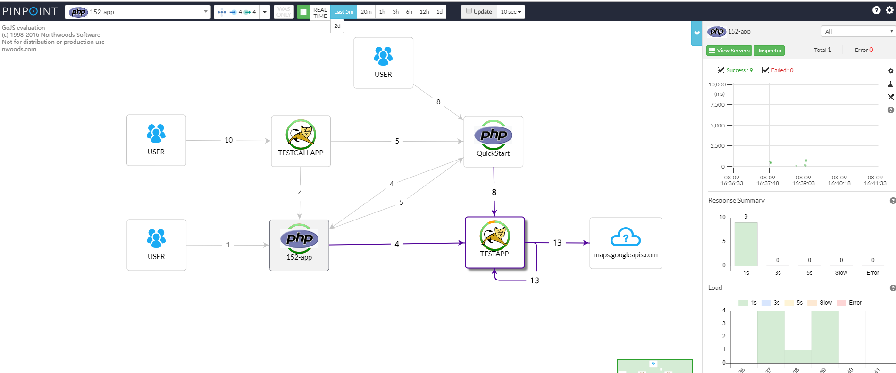

**Visit [our official web site](http://naver.github.io/pinpoint/) for more information and [Latest updates on Pinpoint](https://naver.github.io/pinpoint/news.html)**  


The current stable version is [v0.2.0](https://github.com/naver/pinpoint-c-agent/releases).

# Pinpoint PHP Agent

It is an agent written by C++, PHP, python language. And we hope to support other languages by this agent. Until now, it supports PHP language.

## Getting Started

### Requirement

Dependency|Version
---|----
PHP| php 7+
GCC| GCC 5+
*inux|
Python | Python 3
pinpoint| 1.8.0-RC1
**Composer**| 

### Installation

#### Steps
1. git clone https://github.com/naver/pinpoint-c-agent.git @ *`new_aop_php_agent`*
   
> Build pinpoint-php-module

2. Goto pinpoint_php_ext
   1. phpize        
   2. ./configure
   3. make 
   4. make test # we commanded test the module is RIGHT
   5. make install 
   6. Activation pinpoint module
       [ php.ini ]
        ```ini
        extension=pinpoint_php.so
        # must be unix:(unix sock address)
        pinpoint_php.CollectorHost=unix:/tmp/collector-agent.sock
        pinpoint_php.SendSpanTimeOutMs=0 # 0 is recommanded
        # request should be captured duing 1 second. < 0 means no limited
        pinpoint_php.TraceLimit=-1 
        ```
> Build Collect-agent
3. Goto collector-agent
   1. python3 -m venv env
   2. source env/bin/activate
   3. pip install -r requirements.txt
   4. Change configuration file in conf/
        [collector.conf]
        ```ini
        [Collector]
        # collectorhost and specific port
        CollectorSpanIp=10.10.23.45
        CollectorSpanPort=9905
        CollectorStatIp=10.10.23.45
        CollectorStatPort=9906
        CollectorTcpIp=10.10.23.45
        CollectorTcpPort=9907
        [Common]
        # your web server (nginx&apache) port
        Web_Port=8001   
        Log_Level=ERROR # debug in dev
        # make sure LOG_DIR is exist
        LOG_DIR=/your log dir/
        [Agent]
        # the same as below "pinpoint_php.CollectorHost"
        Address=/tmp/collector-agent.sock
        ```
    5. export COLLECTOR_CONFIG=/full path of collector.conf/
    6. run  collector-agent
        ```
        $ python run.py (or nohup python run.py&)
        ```
   
> Try the aop example
4. Goto pinpoint_php_example
   1. Download composer.phar
   2. php composer.phar install
   3. Set $PWD/app/ as your web site root path

## Overview

> Why we refactor the pinpoint_c_agent (v0.1.x)

1. Hard to support all versions.
2. Slow, v0.1.x version hooks all function.
3. Not support ZTS.

### Pinpoint-c-agent 


### Distributed Tracking system

### Call Stack

### TODO

- [ ] redis,DB,memcache plugins ......
- [ ] workerman,php-swoole plugins 

## Compatibility

Pinpoint Version | PHP| Python
---------------- | ----- | -----
1.8.0-RC1 | PHP 7+ | Python3

## Changes

- Fully support ZTS
- More Stability 
- Higher performance 
- Easy to Use and Maintain

## F & Q

### 1. How to regenerate all AOP files?

Delete *__class_index_table* in Cache/

### 2. Why not support automaticaly update AOP files?

We can DO but perfer not DO! Not found a good efficiency way to implement this.
Watching the files status every time it is a bad deal.

### 3. How much performance loss when I use?

After full test, the AOP code could consume at least 1ms in our env(cpu E5-2660). While, the more function/method you watching, the more you taken. @TODO

### Known Issues

### 1. Exception or Error Message With A Wrong Stack information.

### 2. If I Do Not Use Composer,Can I Use this Version ?

Sorry, `php-simple-aop` not supported wrapping the user class (or internal class) without Composer. By the way [Composer](https://getcomposer.org/) is GOOD. O(∩_∩)O

### 3. Why not support PHP5.x?

https://www.php.net/supported-versions.php

### For the developer

[Click me](pinpoint_php_example/Readme.md)

## License
This project is licensed under the Apache License, Version 2.0.
See [LICENSE](LICENSE) for full license text.

```
Copyright 2018 NAVER Corp.

Licensed under the Apache License, Version 2.0 (the "License");
you may not use this file except in compliance with the License.
You may obtain a copy of the License at

    http://www.apache.org/licenses/LICENSE-2.0

Unless required by applicable law or agreed to in writing, software
distributed under the License is distributed on an "AS IS" BASIS,
WITHOUT WARRANTIES OR CONDITIONS OF ANY KIND, either express or implied.
See the License for the specific language governing permissions and
limitations under the License.
```
